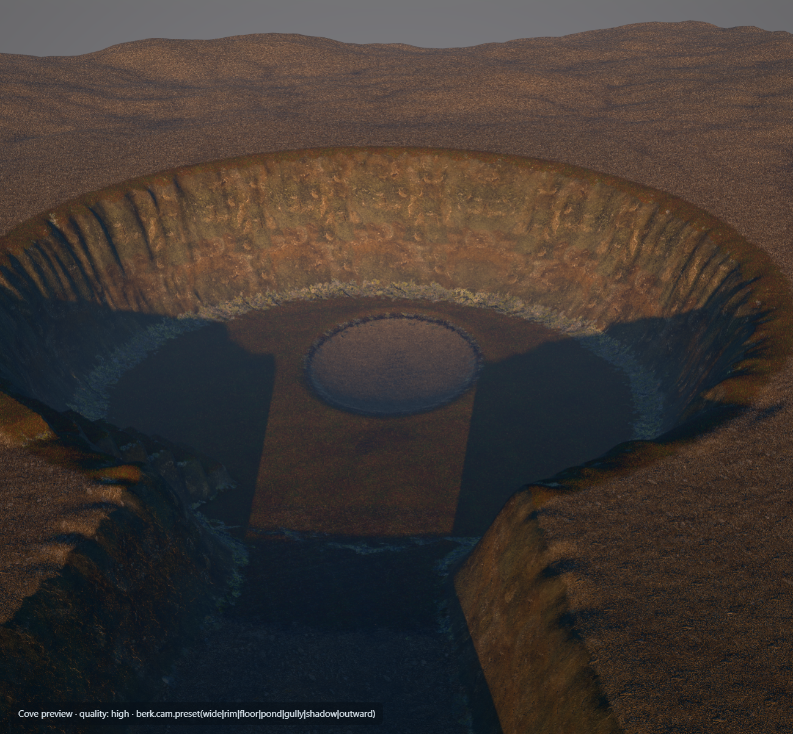

# Isle of Berk

A browser game in the look of *How to Train Your Dragon* 2/3: a stylized Toothless with procedurally animated motion, moving through near-photoreal Nordic environments in golden cinematic light. This repository is a ground-up rebuild of an earlier prototype. Every asset, the motion system and the render pipeline are new.

**Status: Phase 1 (the vertical slice) is in progress.** The engine, the rebuilt Toothless asset, most of the motion core and the Cove terrain are done. Toothless doesn't walk around the world yet: the motion core's last tasks (camera, climbing, lab tuning, the game page) still have to wire it together. Details below.


*Toothless in the Asset Viewer, with the engine's film-look materials. He's built entirely by script in headless Blender.*



*The Cove's base terrain after the shape-and-palette pass. The rocks, pond, trees and grass that dress it are not in yet.*

---

## Running it

Requirements: Node 24 and npm. To rebuild the dragon asset you also need Blender 5.1.2. Everything else runs from npm.

```sh
npm ci
npm run dev        # http://localhost:5190
```

| Page | URL | What it shows today |
|---|---|---|
| Game | `/` | The Phase 1 test scene (lighting, sky, fog, post stack). Toothless isn't on it yet. |
| Asset Viewer | `/viewer.html?char=toothless` | The rebuilt Toothless with film materials. Panels: face morphs, blink, eyes and skin. Clips: wing folds, jaw. |
| Cove preview | `/cove.html` | The Cove terrain with camera presets: `berk.cam.preset('wide' \| 'rim' \| 'floor' \| 'pond' \| 'gully' \| 'shadow' \| 'outward')`. |
| Motion Lab | `/lab.html` | The lab course shell. The motion scripts and live Toothless arrive with Plan 3 Task 15. |

Add `?q=high` or `?q=low` to any page to force a quality preset. Open the browser console and type `berk` for the debug API, e.g. `berk.perf()`, `berk.sun(azimuth, elevation)`, `berk.dragon.clip('wings_folded')`.

| Command | Purpose |
|---|---|
| `npm test` | Unit and asset tests (Vitest), currently 330 passing |
| `npm run typecheck` | TypeScript, strict |
| `npm run build` | Production build into `dist/`. `tools/launch-game.bat` serves it on http://localhost:8750 |
| `npm run toothless:build` | Rebuilds Toothless end to end in headless Blender (~4 min). Byte-identical output on every run |
| `npm run blender:test` | The Blender pipeline's own test suite (55 tests) |
| `npm run terrain:bake` | Re-bakes the Cove heightfield and splat maps (~7 s). Deterministic |
| `npm run cc0:fetch` · `cc0:textures` · `cc0:terrain` | Fetch and pack the CC0 (Poly Haven) assets |

## Project layout

```
src/
  app/           createApp: renderer, scene, loop, App.add / App.remove
  render/        film look: Khronos PBR Neutral tone curve, CSM sun shadows, sky + IBL, Berk fog, N8AO, bloom, material compile hooks
  characters/dragon/
    asset.ts, materials.ts, rigMeta.ts   loading and binding the Toothless asset
    motion/      the procedural motion core (see below)
  world/         Region contract, collision world (three-mesh-bvh), terrain runtime, the Cove
  dev/           the Asset Viewer, Motion Lab and Cove preview pages
pipeline/
  blender/       the Toothless build: SDF sculpt → remesh → rig → weights → face shapes → export, plus QA renders
  terrain/       the Cove bake: shape functions → droplet erosion → masks → splat maps
  cc0/           Poly Haven fetch and texture packing
public/assets/   committed runtime assets (dragon GLBs + rig.json, Cove terrain, terrain textures)
docs/superpowers/specs/   the design specs (roadmap + Phase 1)
docs/superpowers/plans/   the implementation plans
docs/progress/            progress log with renders per milestone
```

## Where Phase 1 stands

The spec is `docs/superpowers/specs/2026-09-26-phase1-vertical-slice-design.md`. Each milestone has an implementation plan in `docs/superpowers/plans/`, run task by task with a review after each task.

| Plan | Scope | State |
|---|---|---|
| **1 · M1 Foundation** | Vite/TS app, render pipeline and film look, quality presets, debug API, page shells, CC0 pipeline | ✅ Complete (final review clean) |
| **2 · M2–M4 Toothless asset** | Headless-Blender pipeline, ~100-bone rig, fan-folding wings, face shapes, tack, export, engine materials, look pass | ✅ Tasks 1–9 done. The look-pass review asked for one small fix: bound a retry loop in the remesher. Final review still to do |
| **3 · M5 Motion core** | Gait, foot planner, body solver, leg IK, pose layers, look and secondary motion, collision, `DragonCharacter` pipeline | 🟡 Tasks 1–12 done. Remaining: 13 orbit camera, 14 climbing, 15 Motion Lab and tuning, 16 the game page |
| **4 · M6 Behaviours and actions** | Pose library (sit, lie, sleep, sniff, stretch, jump, plasma…), idle behaviours, face and mood, jump, plasma and FX | 📝 Plan written and harness-validated, not started. Runs after Plans 2 and 3 |
| **5a · M7 The Cove: ground** | Terrain bake, runtime terrain, splat material, rock kit, pond, assembly | 🟡 Tasks 1–8 plus an added shape-and-palette pass (8b) done. Remaining: 9–11 scanned rocks, 12 pond, 13 assembly, 14 Toothless in the Cove |
| **5b · M7 The Cove: life** | Wind, conifers, grass with trample, ground cover, ambient life, light shafts | 📝 Plan written, not started |
| **6 · M8 Integration** | Polish, performance pass, play-test, switching the desktop shortcut | Not written yet |

### What's built

- **Engine and film look:**
  - golden-hour sun with cascaded shadows
  - physical sky and baked environment light
  - depth fog
  - ambient occlusion and bloom
  - High/Low quality presets
  - a material hook system so shadows, fog and custom shaders compose safely
- **Toothless:**
  - **Built by script.** Signed-distance sculpt, quad remesh, ~100-bone rig and fan-folding rib wings. Face morphs include blink with in-betweens, snarl, smile, and teeth in and out. The tack is saddle, harness, prosthetic tail fin and linkage. A clay QA render suite covers the build.
  - **Film-look materials.** Near-black skin with procedural scales and a cool rim light, and parallax eyes with slit pupils. The dorsal plates glow when he charges plasma.
  - **Rebuilds are byte-identical.** A heat-weight check fails the build if any bone loses its skin.
- **Motion core** (`src/characters/dragon/motion/`):
  - fixed 1/120 s deterministic steps that rebuild the pose from bind every step
  - walk/trot/gallop gait engine
  - foot planner with planted paws and swing arcs
  - body solver that pitches and rolls on slopes
  - pantograph hind legs and sliding-scapula front legs
  - pose layers with piecewise wing folding
  - eyes-first head look; tail, ear and fin springs; breathing
  - collision proxies and a NaN guard
  - every motion constant in one tuning config
- **The Cove:**
  - a deterministic 1024² terrain bake: shape functions, erosion, masks
  - chunked runtime terrain with LOD and skirts
  - two-band collision
  - a six-layer height-blended splat material from CC0 scans, with tints and anti-tiling

### Known gaps and open decisions

- **Toothless's proportions.** Against the film reference he reads compact: the head is large, the neck barely shows, and the body is short. The skeleton meets the spec's locked numbers, so changing it means touching the motion fixtures and the pose library. That's a candidate for a later proportion pass. The planned short-term mitigation is to carry the head higher at rest.
- **Front-leg gait.** In tests the front legs take extra early steps at the prowl and the trot, because the stride limit uses more reach than the foot planner allows. Plan 3 Task 15's lab tuning must fix this, and it's written down as an acceptance item.
- **The Cove still reads as a round crater** from above. The palette is fixed: green floor, mossy wall foot, grey stone. The scanned rock kit and rim trees should break up the outline; if they don't, wall ledges get added at assembly.
- **Folded wings** still read as layered sheets from behind.
- **Performance numbers are from the integrated Intel GPU.** The automated browser runs on the Iris Xe, not the RTX 3080 Ti. Switching Chrome to the RTX in Windows graphics settings would give representative numbers.

### Repository notes

- **Large binary files are committed straight into git, without LFS:** the dragon GLBs, the terrain bake and textures, and the progress renders. In total that's about 40 MB of history, and no single file is above 6 MB. New progress captures are saved as JPEG to slow that growth. Moving to Git LFS is worth doing before the island assets in Phase 3 land.
- **CC0 assets come from Poly Haven.** `CREDITS.md` is generated from `pipeline/cc0/manifest.json`.
- **Never bind Ctrl in game input.** Ctrl+W closes the browser tab even under pointer lock.

## Roadmap

Phase 1 vertical slice (engine, Toothless, the Cove) → Phase 2 flight and Hiccup → Phase 3 the full island → Phase 4 the village → Phase 5 NPC dragons, villagers and animals. See `docs/superpowers/specs/2026-09-26-isle-of-berk-roadmap.md`.
