# Phase 1 progress log

## M1 — Foundation (2026-09-27)

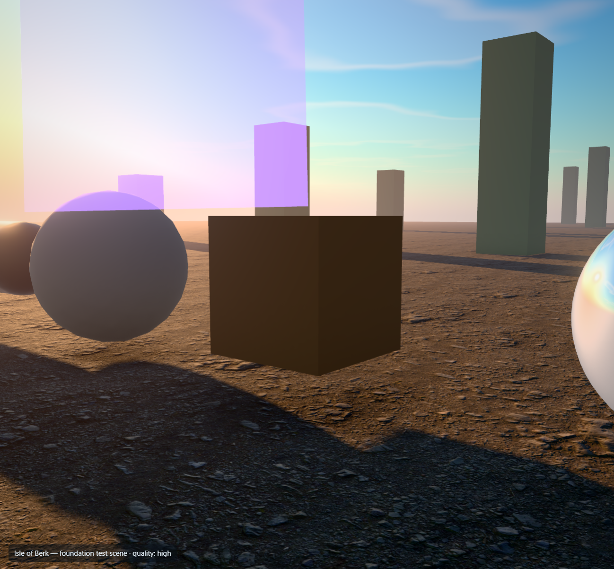 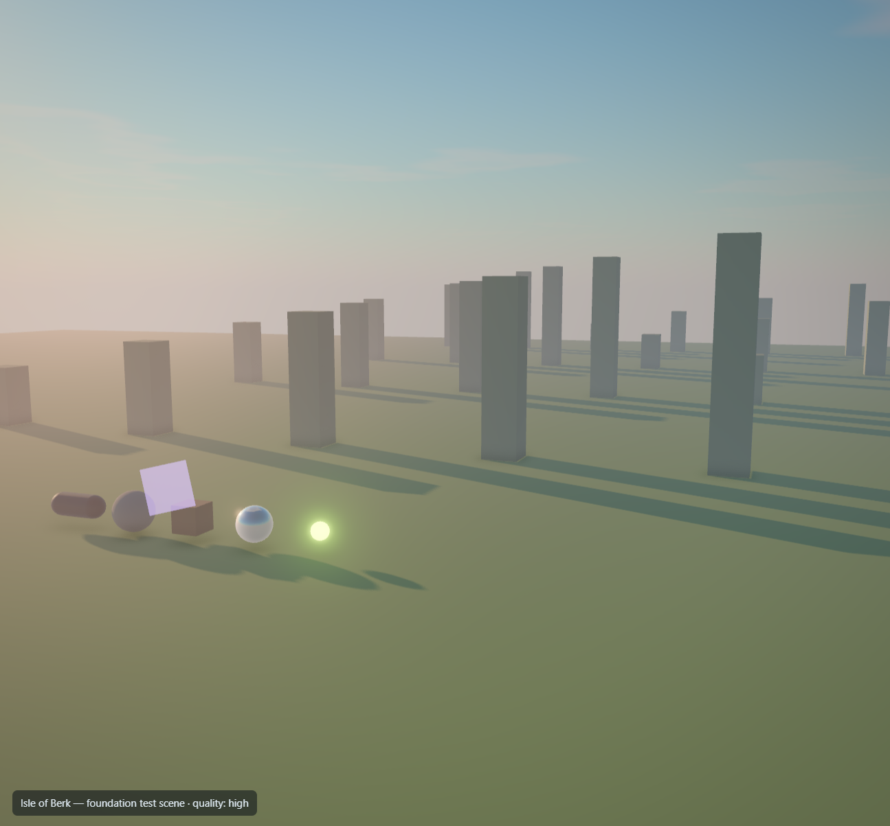
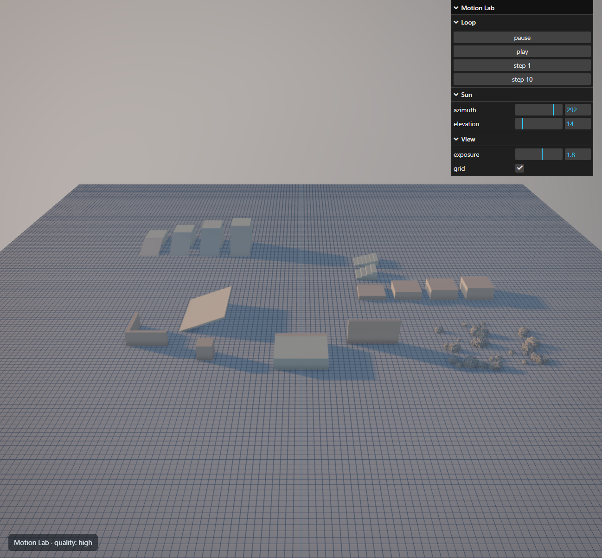 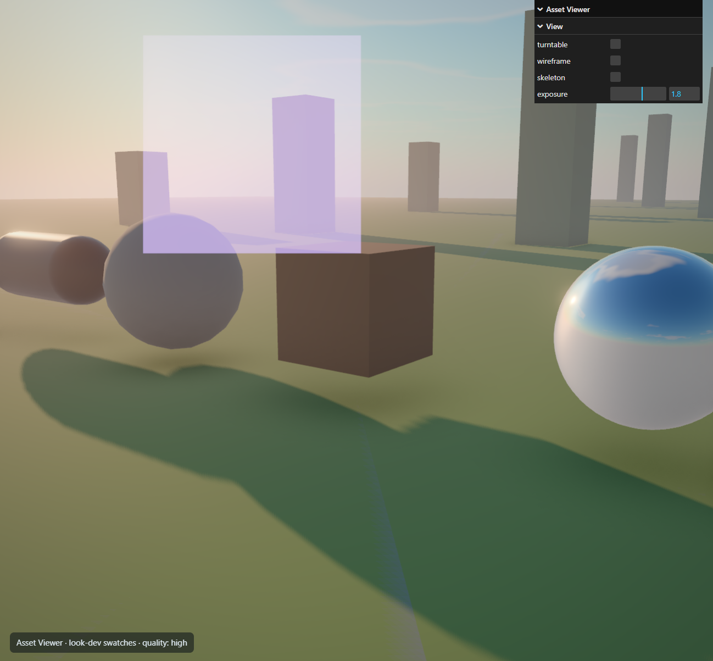

Additional captures: 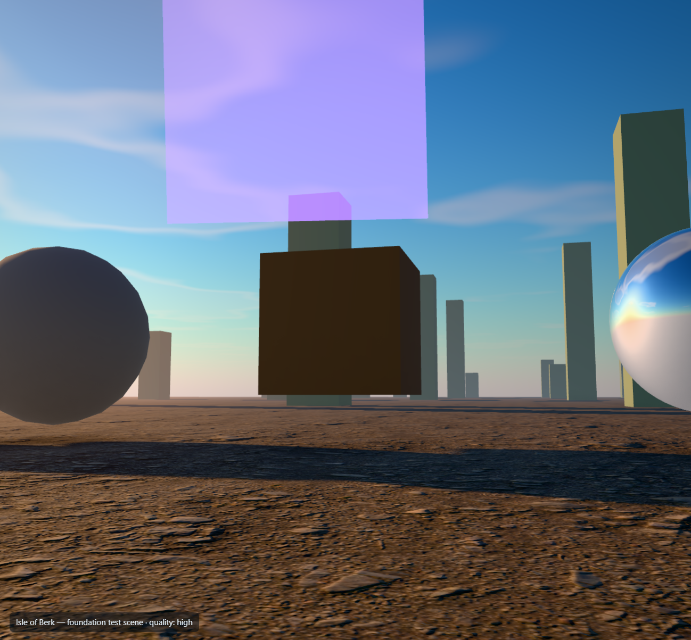 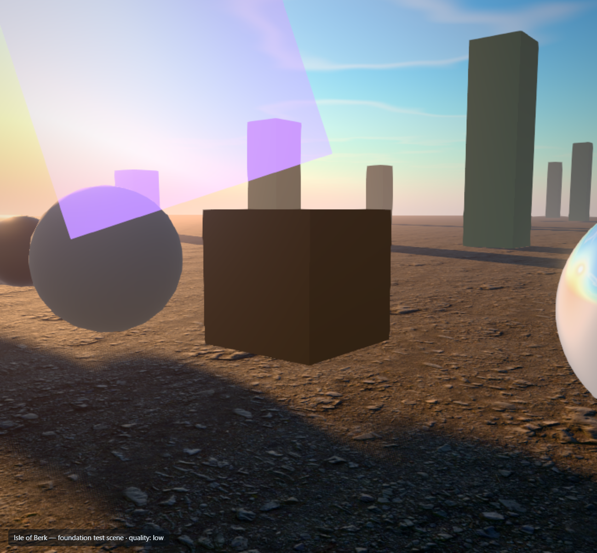 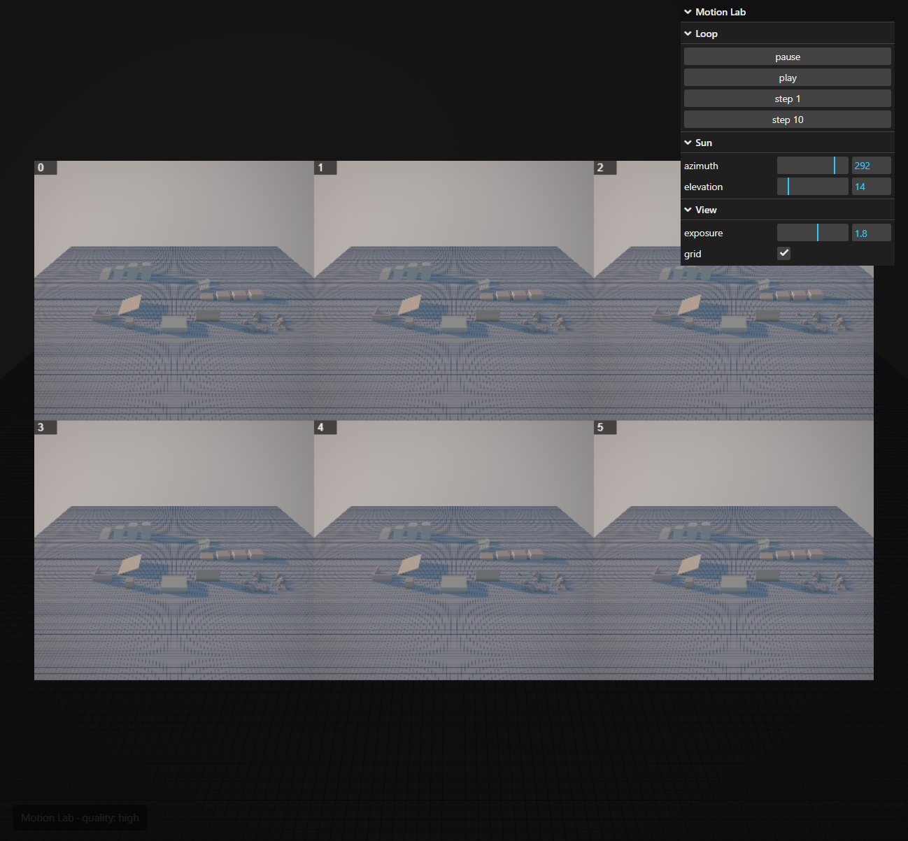 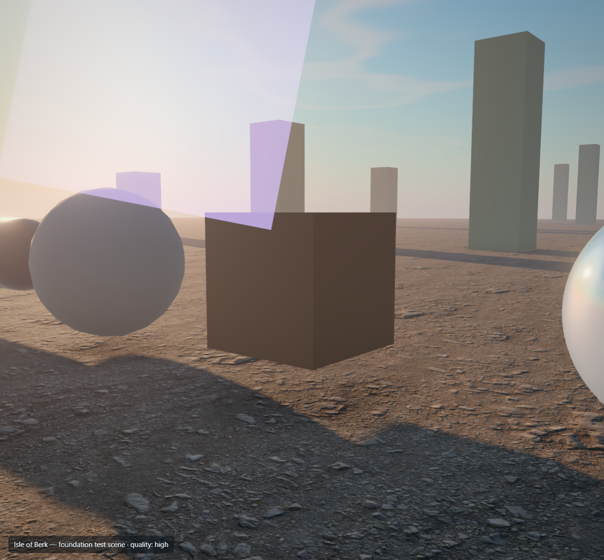

`m1-hero`, `m1-wide`, `m1-low`, `m1-q-low` and `m1-viewer` were re-taken in the final-review fix wave (textured ground, Neutral tone curve, no studio floor under the viewer's swatches). `m1-lab`, `m1-lab-filmstrip` and `m1-ground` predate the Neutral switch.

- Pages: game `/`, Motion Lab `/lab.html`, Asset Viewer `/viewer.html` — all render the lit test scene, in dev (`npm run dev`, :5190) and in the production build (`npm run build` → served on :8750 via `tools/serve-dist.ps1`); console clean on every page (the only console item anywhere is a benign lil-gui third-party accessibility lint, "A form field element should have an id or name attribute", on `/lab.html` and `/viewer.html` — not a JS error or warning).
- Render stack: CSM (4 cascades on High / 2 on Low) · Preetham sky + clouds → PMREM IBL · Berk height fog · N8AO (fading under the Berk haze via a `scene.fog` proxy) · bloom · Khronos PBR Neutral tone mapping (AgX until the final review) · grade LUT.
- Tuned values (all committed in Task 8): exposure 1.8 (was 1.0; tuned under AgX, kept for Neutral — see the tone-curve decision below), sky exposure 0.15 (was 0.5), fog density 0.0035 (unchanged; colours refit — `color` (0.15, 0.17, 0.2), `sunColor` (1.4, 0.78, 0.53), `inscatterExponent` 5, was 6), sun intensity 3.0 (unchanged).
- MSAA + N8AO decision: **kept MSAA 4× on High** — zoomed crops of edges (cube/ground, block/sky, swatch row, far blocks) showed clean anti-aliasing with no AO/MSAA halos. Low runs `msaaSamples: 0` and gets SMAA instead, per the post-order rule ("SMAA only when MSAA is off").
- Perf (`berk.perf(30)`, via the `gpuFence` 1-pixel readback — `gl.finish()` alone reports flush time, not render time, on Chrome's command-buffer WebGL): on `ANGLE (Intel, Intel(R) Iris(R) Xe Graphics (0x000046A6) Direct3D11 vs_5_0 ps_5_0, D3D11)` — High/hero ≈ 30.63–31.96 ms/frame (31.96, 30.74, 30.63; 117 calls, 25,304 tris) · Low/hero ≈ 3.09–3.15 ms/frame (3.09, 3.15, 3.10; 79 calls, 14,854 tris).
- CC0 pipeline (Poly Haven, `pipeline/cc0/`): `forest_ground_04` — 2k source textures (diff/nor/arm), processed to 1024×1024 WebP (diff 429,064 B, nor 700,508 B, arm 275,628 B) and wired into the test-scene ground material. `rock_moss_set_01` — 1k glTF, fetched and credited in `CREDITS.md`/`manifest.json`, cached but not yet placed in a scene (no `install` entry).

### Rulings and notes

- **Ruling 4 (GPU preference):** no GPU-preference change and no KTX2 install were made without the user's OK. Chrome is still rendering on the integrated Intel Iris Xe, so every High-preset performance number above is provisional until Chrome is run on the RTX 3080 Ti — the user can switch this in Windows Settings > System > Display > Graphics.
- **Ruling 1 (branch):** all M1 work happened on branch `phase1-slice` (off `main`); `main` was never touched.
- Known cosmetic issue: the 400 m test ground plane's far edge reads as a soft-contrast line at the horizon, on the side away from the sun (see Task 8's sky checklist). It's a finite-plane artifact of the M1 look-dev test scene, not the render stack; the Cove's real terrain and sea horizon will need their own check later.
- The launcher (`tools/launch-game.bat` / `tools/serve-dist.ps1`, serving `dist/` on :8750 via the tiny `tools/serve-dist.py` handler — bound to `127.0.0.1` only, with corrected `.webp`/`.js` MIME types) is built but **not wired to the desktop shortcut yet** — that happens at M8. The server keeps running in the background after the browser closes, same as the old `python -m http.server` launcher; stop it by closing its python process.

### Hardening (final review)

The final whole-branch review found no Critical issues; its three Important findings and the should-fix items were fixed in one wave (commits `c5126e0`, `68dc682`, `05c0f59`, `ea4c9f1`, `a153256` and this log's commit).

**Tone curve: Khronos PBR Neutral, chosen by the controller's side-by-side (spec §4.2/§11); the AgX/ACES captures remain for the user to re-decide.** `berk.toneMapping('agx' | 'neutral' | 'aces')` switches the curve at runtime for A/B (OutputPass rebuilds its define on the next frame). Exposure stays 1.8: under Neutral neither the ground nor the open sky clips in the hero or wide shots; the only pixels at 255 are the emissive core, a mirror glint, the additive sprite over the sun's aureole, and — in the hero only — a 0.16 %-of-frame patch of the aureole at the horizon beside the sun, clipped in the red channel alone (hue kept, no banding).

| | hero | wide |
|---|---|---|
| AgX | 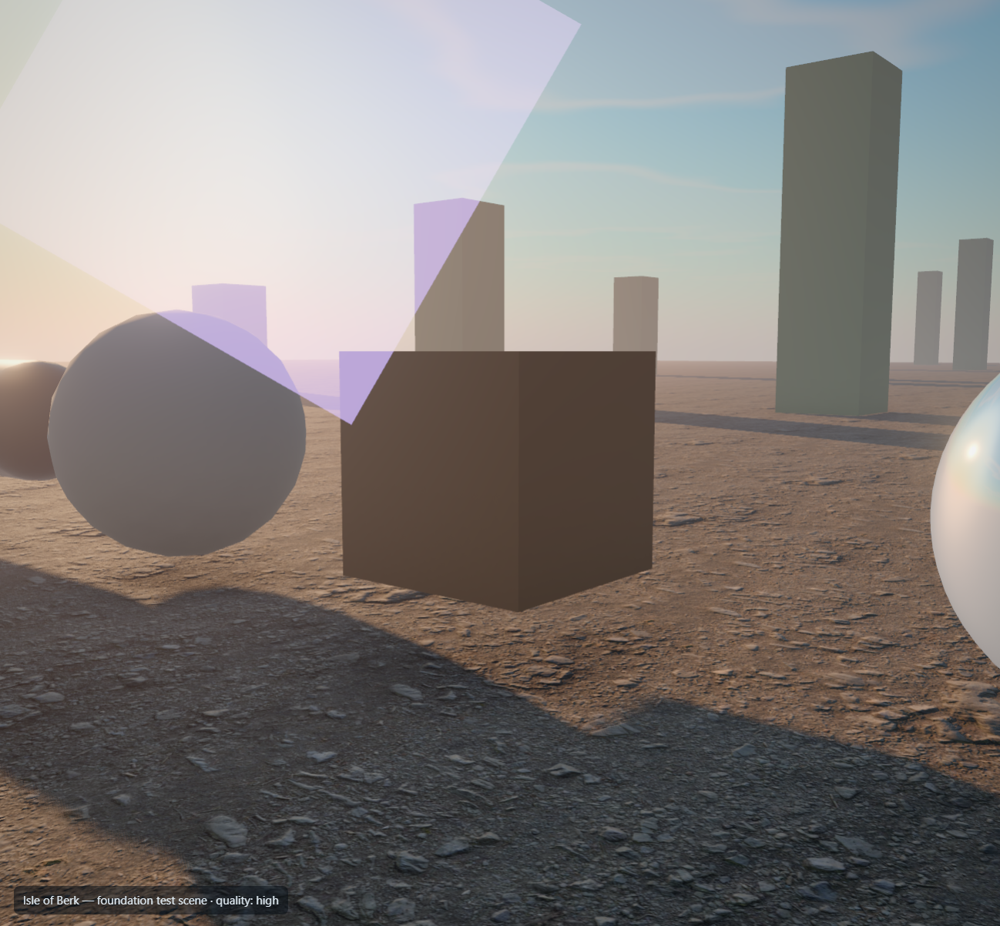 | 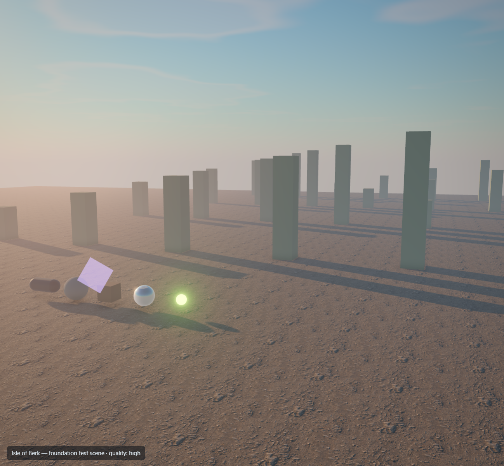 |
| Neutral (default) | 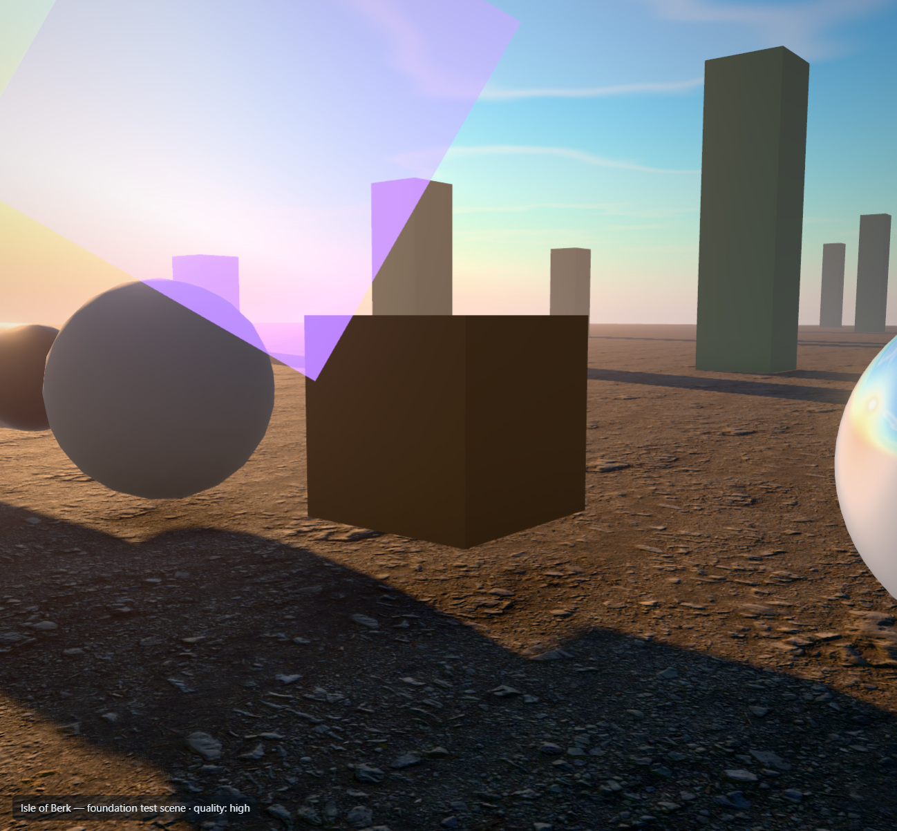 | 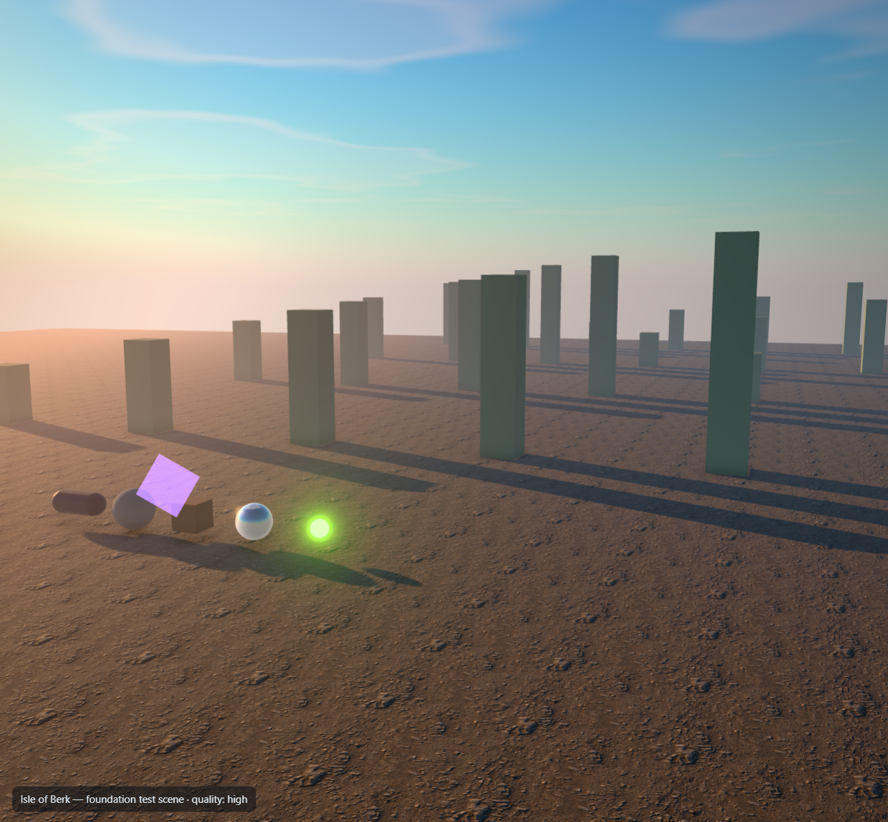 |
| ACES | 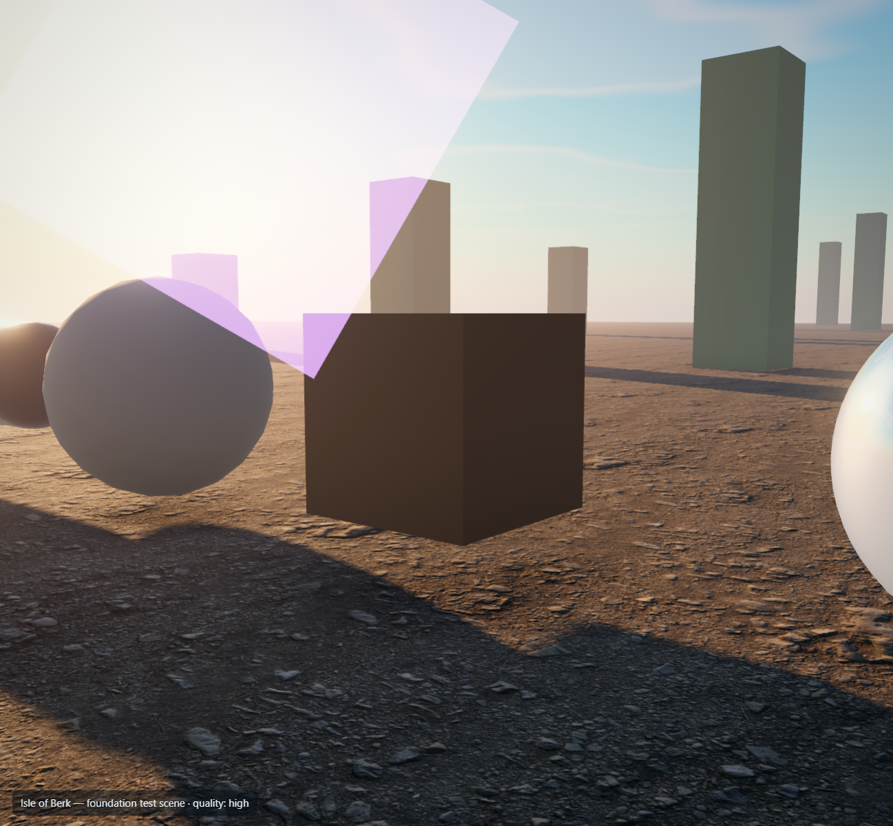 | 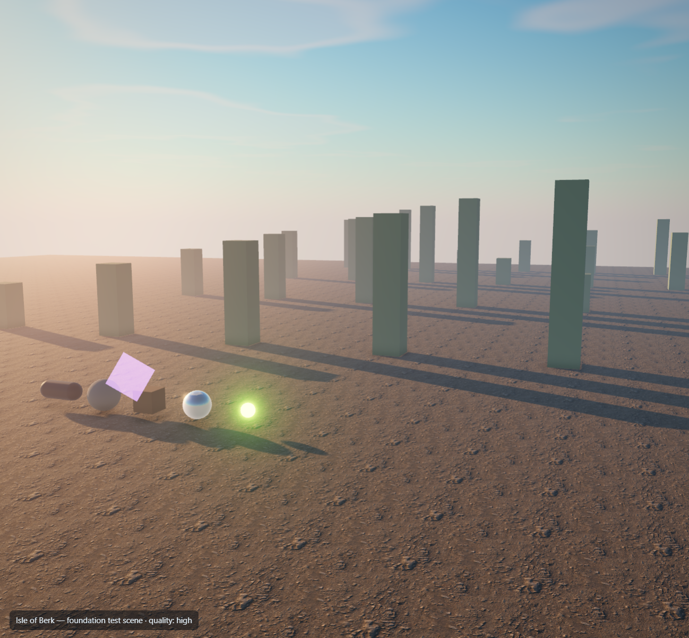 |

Same paused frame, `?q=high`, exposure 1.8 (tuned under AgX); measured on the captures (8-bit display values):
- **AgX** — softest. Highlights roll off to a creamy, desaturated off-white around the sun (aureole L ≈ 214, saturation 0.17) and a pale cream-white emissive core with a soft yellow-green halo; nothing clips (0.00 % of the hero frame at 254+). Greens and the warm key are muted (blocks sat. 0.06–0.08, sunlit ground (120, 99, 86)). Shadows open (shadowed ground L ≈ 65). Brightest ground mid-tones (sunlit ground L 95–103).
- **Neutral** — hue-preserving, the most saturated and contrasty. The glow toward the sun stays orange/peach (pink-magenta where the violet sprite crosses it); the emissive keeps a mint-green core inside a saturated lime halo (halo sat. 0.54 vs 0.30 AgX). Richest warm key (sunlit ground (94, 69, 50), sat. 0.46) and greens (blocks 0.12–0.14); deep blue sky (sat. 0.40–0.49). Deepest shadows (shadowed ground L ≈ 32; 13 % of the hero frame below L 25). Darkest ground mid-tones (sunlit ground L 64–73). 3.4 % of the hero frame reaches 254+, nearly all of it the additive sprite over the aureole.
- **ACES** — brightest highlights, burning toward white: a large near-white cream aureole (L ≈ 233, sat. 0.11) and a white emissive core; the widest near-white area (4.1 % of the hero frame at 250+, 0.9 % at 254+). Saturation and shadow depth sit between the other two (shadowed ground L ≈ 46; sunlit ground L 82–92). three's ACES also scales exposure by 1/0.6.

**AO under the Berk fog.** N8AO fades AO only under three's own `scene.fog`, so AO used to darken the haze. `berkFogProxy` (a `FogExp2` set as `scene.fog`) now follows the Berk fog: colour = haze colour, density refit on every `setFogParams` to match `berkFogFactor` at 120 m on a level ray at 1.6 m eye height (0.00525 for the golden fog; within 0.2 % of the least-squares fit over 75–150 m). Berk materials ignore it (their fog chunk tests `BERK_FOG` first). A/B on the wide camera in N8AO's AO display mode (`berk.aoDisplay('AO')`) — before / after / the per-pixel AO deficit ×25 (before on top):

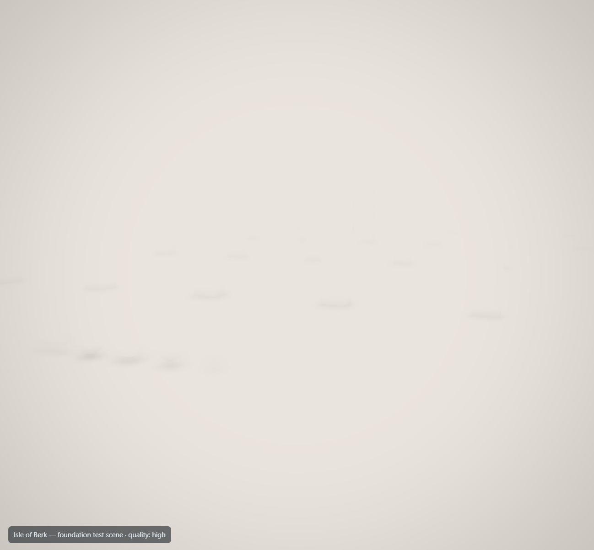  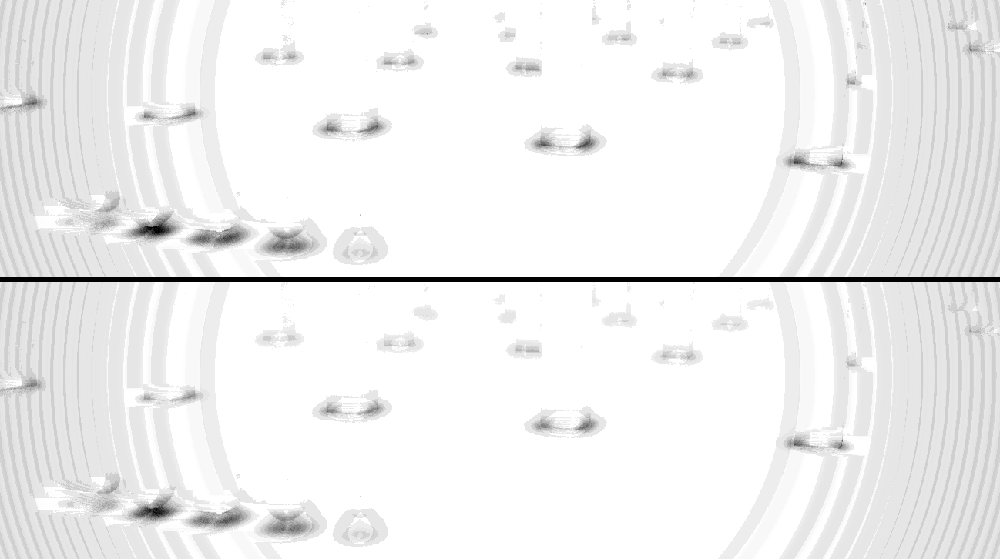

Verdict: distant AO fades, near contact AO stays — peak AO darkening on the far block rows drops 34 % (5.9 → 3.9 levels), mid rows 13 %, the near swatches 9 %.

What else changed:
- **Asset reloads** (`App.remove(root)`): releases every material from CSM (`LightingRig.releaseMaterial`: its map entry, CSM defines and base hook go; fog hooks stay), detaches root and frees it. `disposeObject` now also covers Points/Lines, sprite materials, skeletons and closes decoded ImageBitmaps. Browser check: three reloads of a CC0 glTF in the Asset Viewer leave geometries/textures/programs flat (51 / 40 / 24).
- **Post stack:** N8AO's quad-wrapped materials and the bloom high-pass material are freed on dispose; N8AO is transparency-aware up front (no per-frame scene walk, no mid-game allocation); the grade's vignette `smoothstep` edges are in order.
- **Shadows update once per frame** (`shadowMap.autoUpdate = false`, `needsUpdate` raised at the top of the frame): N8AO's extra scene renders reuse the maps. Same-moment A/B on the Iris Xe (High/wide, `berk.perf`): 40.9–42.9 ms vs 47.3–51.1 ms per frame (~15 %). Absolute numbers are higher than M1's today on the same machine (Low 9.5–11 ms vs 3.1 ms), so only same-moment A/Bs compare.
- **Lifecycle:** the loop stops on `pagehide` and a page restored from the bfcache reloads; after a WebGL context restore the IBL is re-baked (three r186 rebuilds everything else itself — verified with `WEBGL_lose_context`: without the re-bake the IBL is gone).
- **Guards and docs:** the sky patch is all-or-nothing; CSM lights-chunk repair guards and the bloom prefilter are tested; `MeshToonMaterial` gets CSM; iridescent materials are refused with an error (CSM's global lights chunk can't compile them); perf/material-pipeline contracts documented.
- **Viewer:** the grey studio floor only appears with `?asset=` (it z-fought the swatches' ground). **Pipeline:** the texture-map lookup is anchored on `_<token>_<res>.`; cache paths are contained. **Course:** tests pin the 75° wall, the closed L corner and the pillar footprint for M5.

### Known gaps

- No real GLSL compile smoke test yet (a headless browser loading every page at `q=high`/`q=low`) — planned before M7.
- Additive effects fog toward the haze colour: M6/M7 particles must use `fog: false` or fade to black.
- The film strip renders each frame twice (`loop.step` renders, then the strip renders again).
- The Motion Lab uses the golden-hour rig, not the studio lighting of spec §3.5 (an M5 note).
- Mouse look is sampled per step (an M5 decision).
- The CSM lights chunk still needs rebuilding from core: iridescent materials can't compile (the setup guard only reports it), and probe-grid irradiance, the SunLight loop and the point-shadow type guard are missing.

## M2–M4 — Toothless asset (2026-09-27)

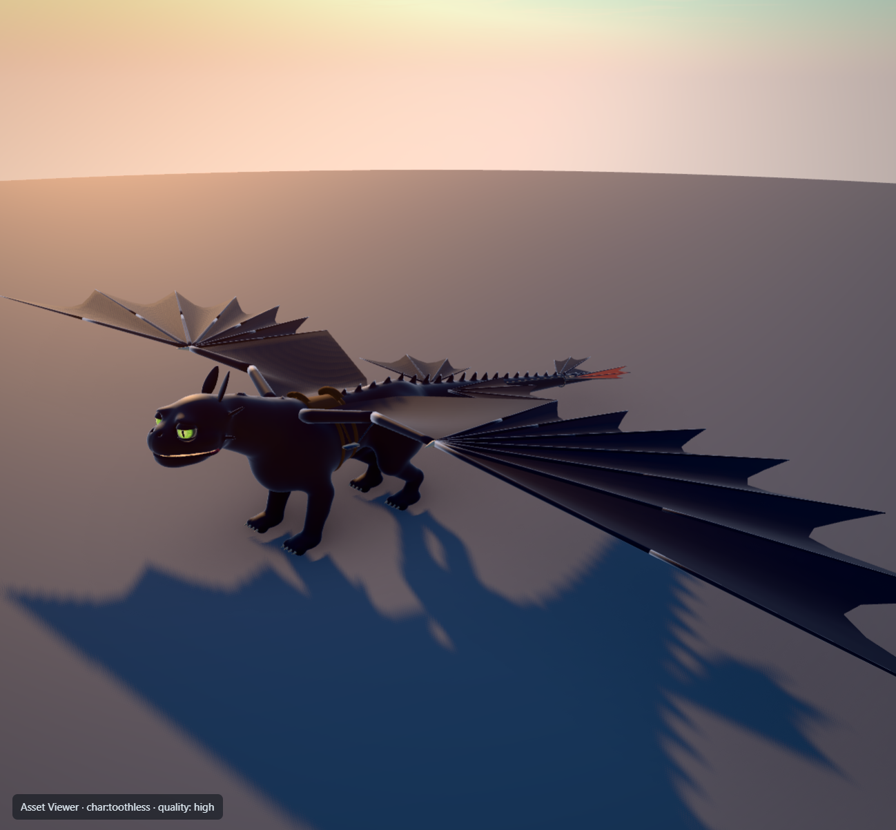 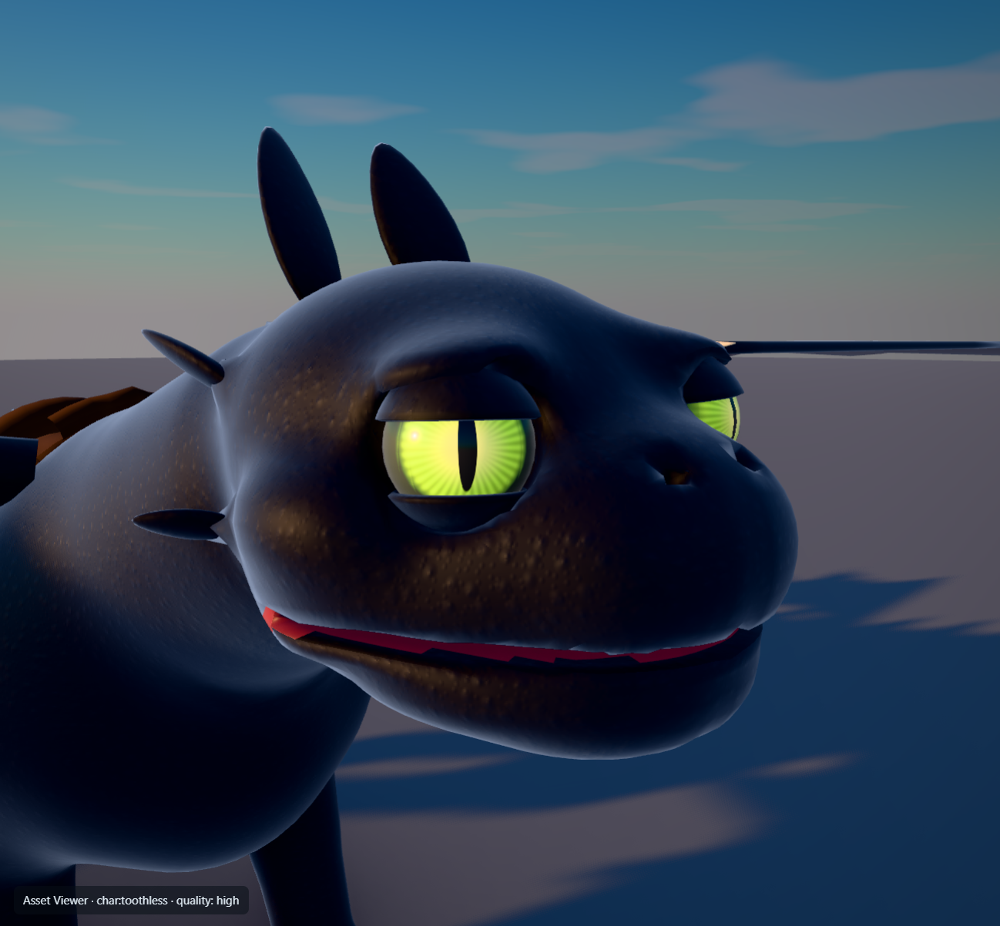
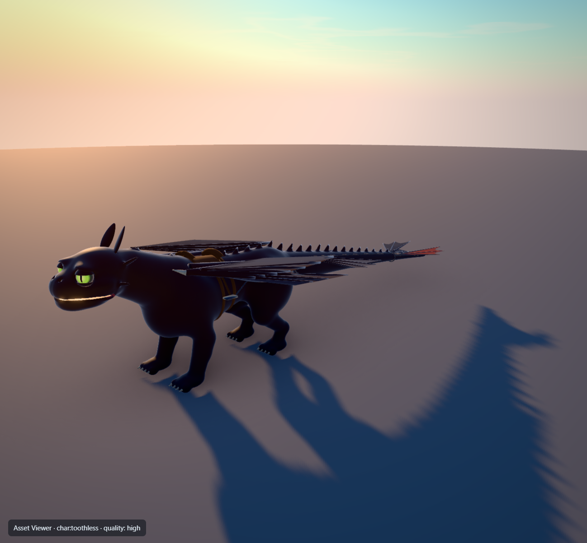 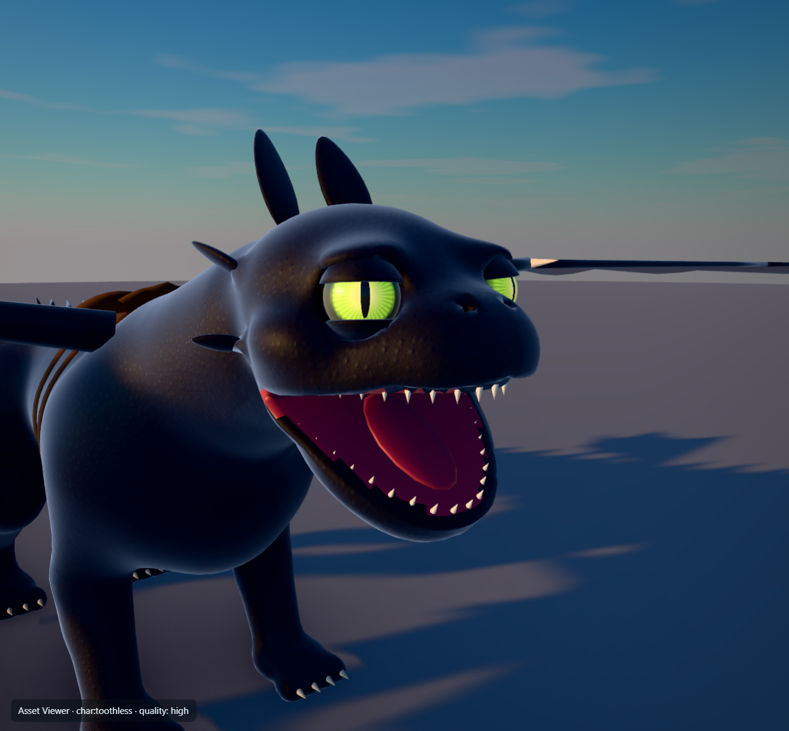

Blender QA renders: 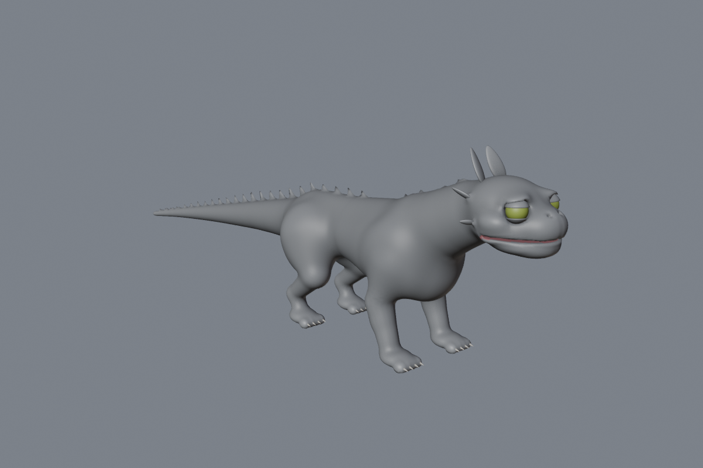 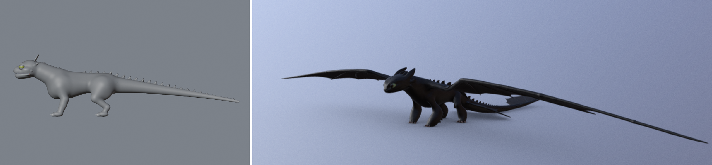 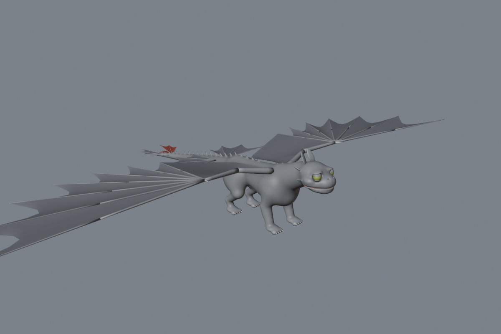 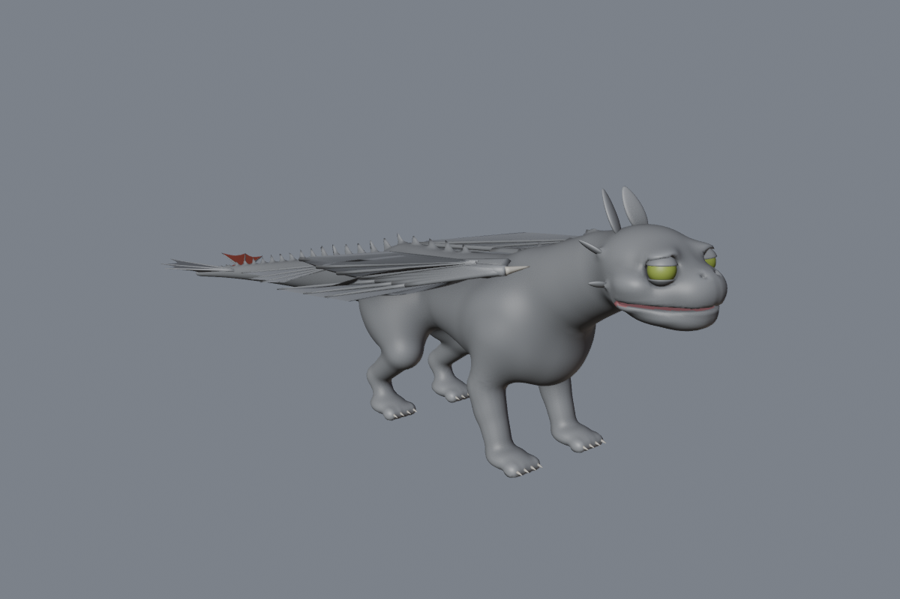 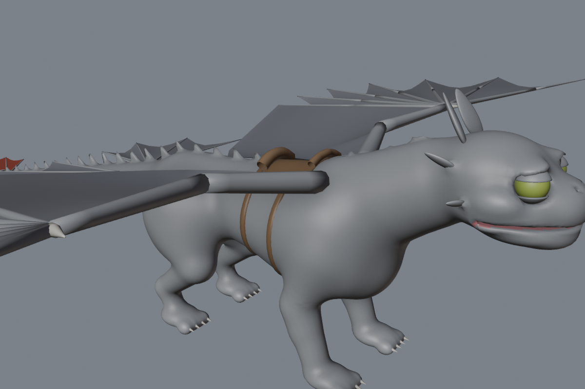 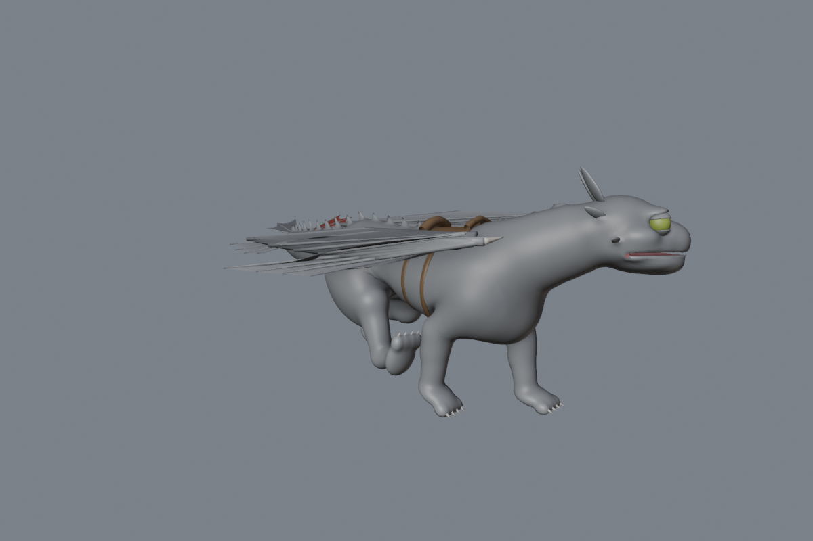

- Pipeline: headless Blender 5.1 under `pipeline/blender/` (`npm run toothless:build` → stages model → wings → tack → assemble → export; `npm run blender:test`, 43 tests). Sculpt = numpy SDF → OpenVDB → voxel remesh → QuadriFlow (24k-face body), heat weights plus scripted corrections, face shape keys, a `_MASK` vertex attribute (x = ray-traced AO, y = underside, z = dorsal plates).
- Assets (`public/assets/characters/toothless/`): `toothless.glb` 4,434,716 B (budget 6 MB), **75,798 triangles** (budget 90k), one 101-joint skin, 9 primitives / 9 materials (`skin`, `membrane`, `eye`, `mouth`, `teeth`, `claw`, `prosthetic`, `leather`, `metal`), 9 morphs (`smile`, `snarl`, `nostril_flare`, `blink_L/R`, `squint`, `teeth_out`, `membrane_pleat_L/R`); `toothless.poses.glb` 299,920 B, 6 clips keying every bone (`bind`, `wings_fold_25`, `wings_half`, `wings_fold_75`, `wings_folded`, `jaw_open`); `toothless.rig.json` (chains, limbs + poles + limits, contacts, proxies, anchors, jaw, wings/foldClips, ears, proportions).
- Engine binding (`src/characters/dragon/`): `validateRig` (every bone reference must resolve; a `RigMeta` stays assignable to Plan 3's `MotionRig`), `createDragonMaterials`, `loadDragonAsset` (binds engine materials by GLB material name, zeroes the file's morph weights, maps bones/clips/morphs). Asset Viewer: `viewer.html?char=toothless` with Face / Eyes / Skin folders and `berk.dragon.{clip, morph, pupil, stats}`.

### Decisions

- **Procedural skin instead of UV bakes** (Ruling 2, amending spec §5.2 step 6 / §5.8): scales are cellular noise sampled triplanar in bind-pose object space (the skinned `position` attribute *is* the bind pose, so they stick to the skin), bump-mapped from screen derivatives; AO and region masks come from `_MASK`. No UV seams or bake steps, and close-ups stay sharp.
- **LOD0 ≤ 90k triangles** (Ruling 2, amending spec §5.9's 30–40k): the 24k-quad body carries the sculpted forms instead of a baked normal map. One hero LOD in Phase 1 (Ruling 4).
- **Film-look materials, tuned in the viewer under Khronos PBR Neutral at exposure 1.8** (curve and exposure unchanged). Skin `0x15171d`, roughness 0.62, **specularIntensity 0.5**, clearcoat 0.12, cool sheen 0.45 (`0x35507a`); membrane `0x1b1e26`, roughness 0.78, specularIntensity 0.5, double-sided. Rim `(0.55, 0.68, 0.95)` × 0.35, scale bump 1.5 mm, eyes pupil 0.15 / glow 0.35 / iris depth 0.08. Measured under a frontal sun: with full dielectric reflectance, the sky reflection alone lifted the lit skin to slate grey (flank sRGB ≈ (46, 57, 76); diffuse alone ≈ (0, 3, 28)). At half reflectance it reads navy-black (≈ (26, 37, 59)).
- **Rim on the geometric normal**, fresnel⁴ × sun-facing. On the scale-bumped normal every scale edge glinted, a blue-white speckle over the whole body. A membrane is a large flat panel, so its rim is scaled to 0.3, or it silvers the whole wing when seen edge-on.
- **Scale detail fades with the pixel footprint** (full detail up close, gone by ~0.35 cells per pixel): at gameplay distances the 2–3 cm cells aliased into glitter.

### Known gaps (→ Task 9 look pass)

- Sculpt: heavy neutral upper lids read sleepy; the big ear plates stand upright, and the small ones read as side horns; the torso is bulbous rather than panther-like; the lip line is frog-wide.
- Mouth at rest: the jaw rests slightly open, so a pink band shows along the lip line, with a stair-stepped mouth-material edge (Task 9's `jaw.restCloseRad` closes it).
- Snarl: the lip peel is weak. Folded wings read as stacked planks. The spread membrane reads as pleated paper (planform targets).

## Look pass — Toothless (Plan 2 Task 9, 2026-09-27)

Engine viewer, golden hour: before (Task 8) | after.

 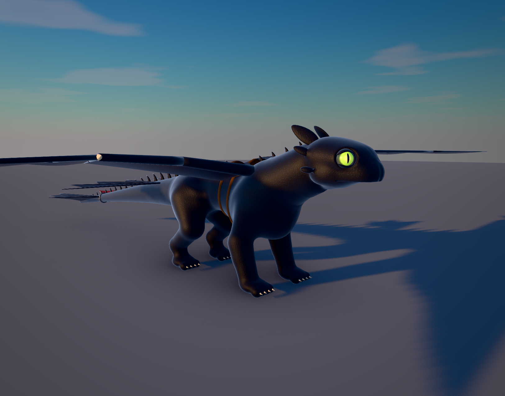
 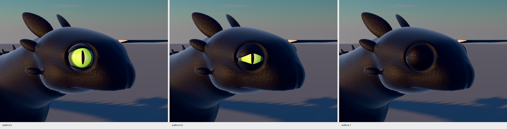

The after-face strip is `setBlink` 0 / 0.5 / 1. More views: 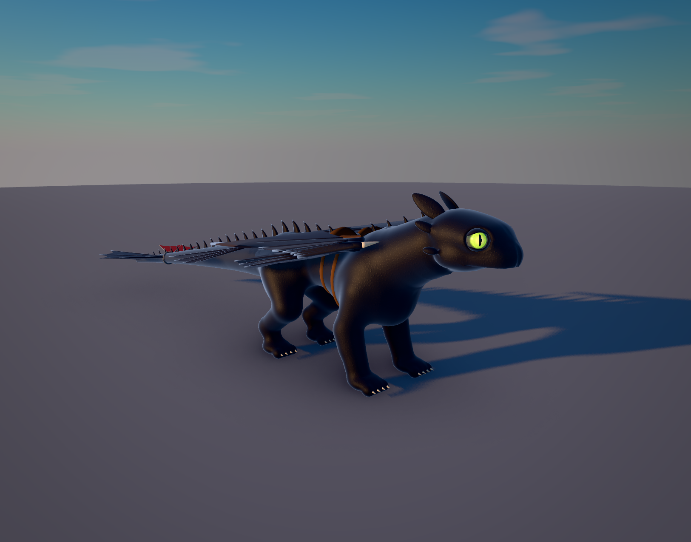 (the `wings_folded` clip with the membrane pleat), and the clay set 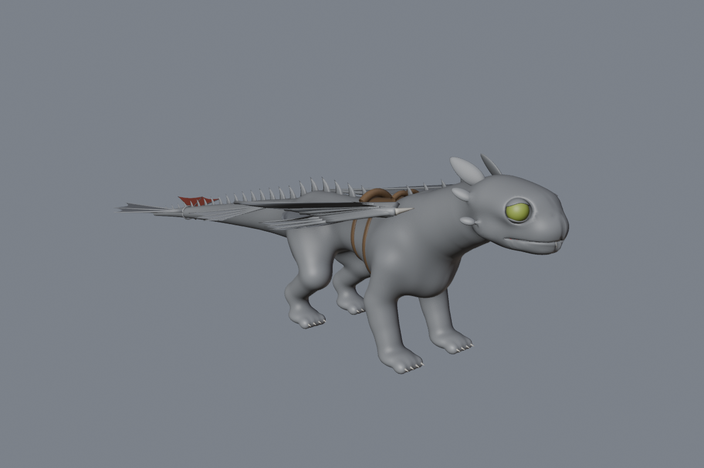 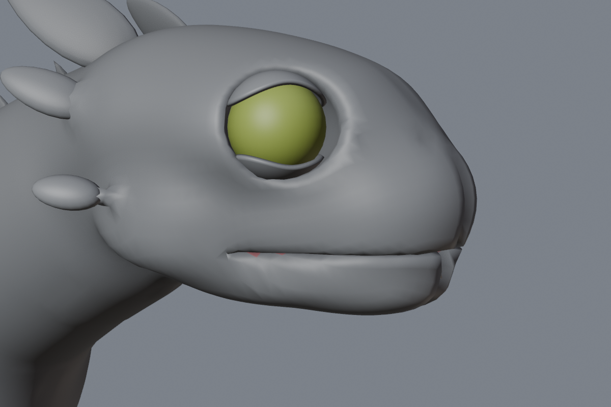 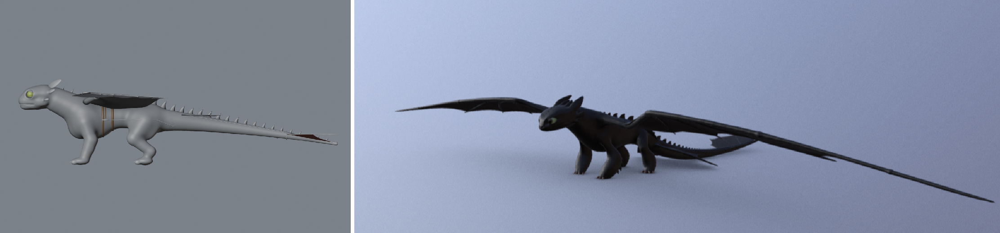 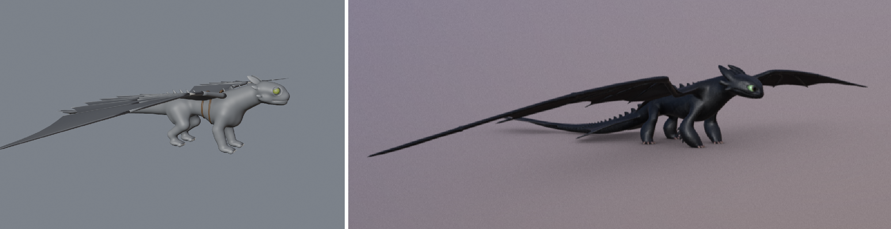. QA re-checks: 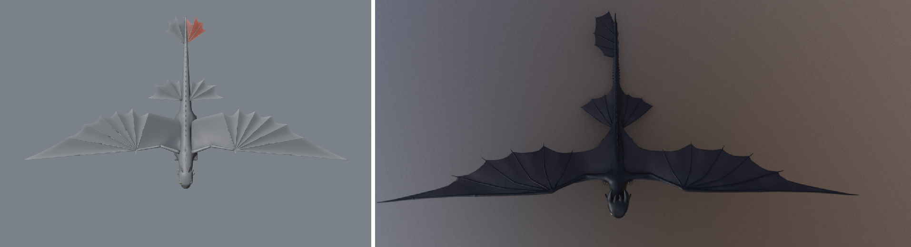 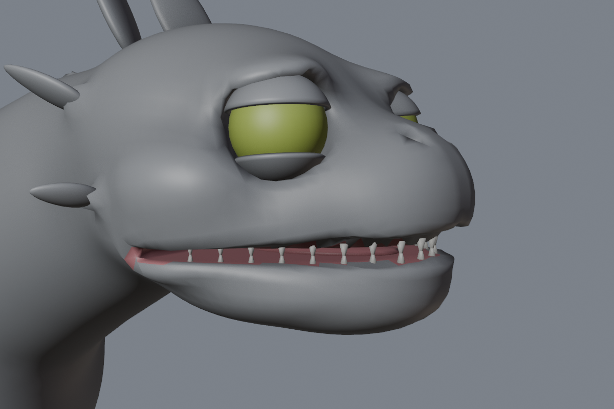 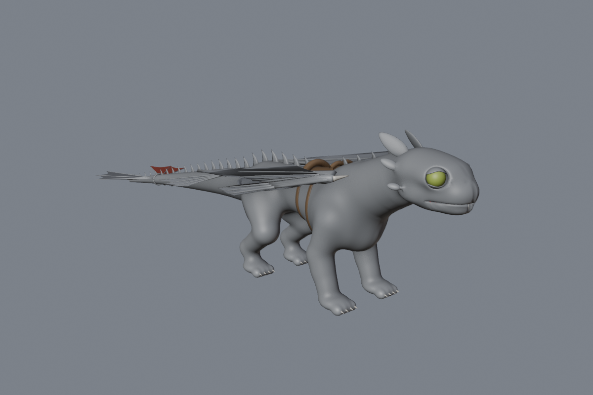 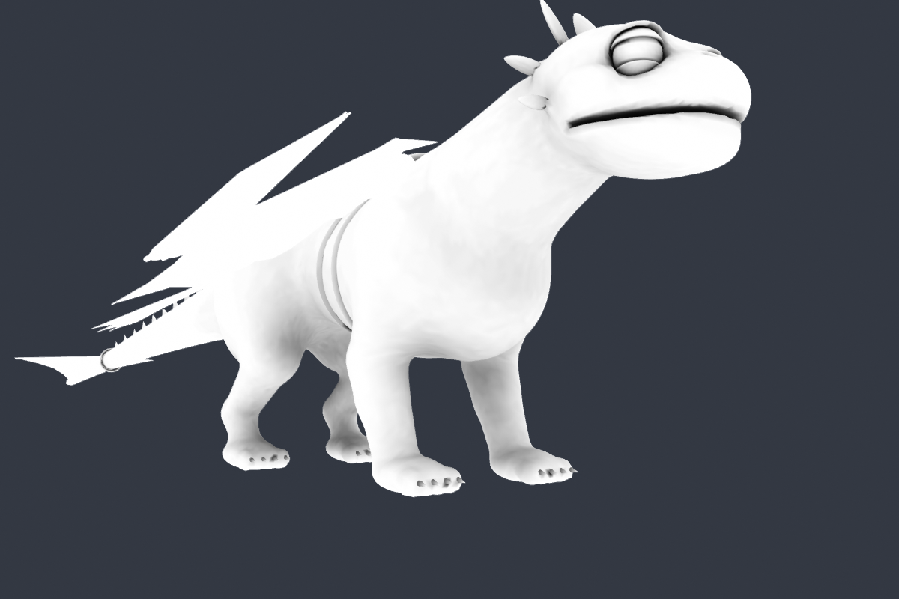

- **Ears** swept back along the skull: `EARS_L` pitch/yaw/roll 62/−14/−12 → 32/−12/0 for the big flap, with the two small pairs lower and tucked behind and below it (22/−24/0, 8/−28/0) as rounded nubs, not horns. Each plate is also turned about its own length so its broad face looks outward (a plate shape in `parts.py`; the bones only follow the length axis). Bone heads and lengths are unchanged; `tests/fixtures/toothlessRig.ts` follows.
- **Head** remodelled with the mouth closed: broad, a little flatter on top than tall, tapering without a stop to a rounded snout with the nostrils at the front. The lip line is solved on the sculpted surface and closes below the back of the eye (no frog gape).
- **Mouth sealed at rest.** The sculpt opens the lower jaw by `JAW_REST_CLOSE_RAD` = 0.09 rad at bind (a wedge slit ≥ 1.6 cm at the corners, 4.6 cm at the front, which heat weighting needs). Everything below the lips rides that opening through a smooth field warp, and a scripted weight correction sets the jaw's weight around the lips to the same warp. `loadDragonAsset` turns the jaw bone by `rig.jaw.restCloseRad`, and every clip's jaw track with it, so the lips meet along the whole line. The mouth material now stops 2 cm inside the corners.
- **Eyes** open and curious: the upper lid covers ≤ 15 % of the iris height and the lower ≤ 8 % (tested along the gaze), and the lid edges arc into an almond. The blink has true in-between keys (`blink_{L,R}_a`/`_b` at 1/3 and 2/3), so the lid follows its arc instead of cutting through the eye (tested). `DragonAsset.setBlink(side, w)` blends them piecewise; the viewer's Eyes folder has blink sliders.
- **Torso** is a panther's: a deep but narrower ribcage, a waist tucked up and in, and a compact rump. **Legs** keep their joints and stay short, now thick all the way down to bigger paws.
- **Dorsal plates** are separate crisp fins (the 24k-face body could not hold sculpted blades), rigid on the neck, spine and tail bones, and they carry the `_MASK` dorsal channel.
- **Wings:** a long pointed tip on the leading rib, the other ribs shorter and fanned rearward (angles −5…108°, lengths 4.75 → 1.65 m), shallow per-panel scallops (3–14 %), gentle billow, and larger tail fins. The inner membrane's waist attach point now sits on the skin. The folded bundle ends at the hips (max y 1.46 m, was 1.64) and passes the fold gates unchanged (max |x| 0.768, min z 1.048, fold-sample step 90.35°). The pleat key is 5 cm (was 3.5).
- **Snarl and teeth:** the upper lip lifts 5.5 cm and peels outward, the bridge crinkles and the front lower lip drops. The teeth are larger (3 → 2 cm, front to corners), fitted inside the closed head, and the rows are interleaved: the lower row sits half a spacing along and further in, so the tips never meet (tested). The smile is stronger. AO is stored with a gamma of 1.6, so creases read deeper.
- **Pipeline robustness.** Rebuilds are byte-identical: a canonical mesh order after the QuadriFlow weld and fixed-order spheres (two from-scratch builds give `toothless.glb` 4737ecb4…). The heat-weight canary reads the raw weights; it caught a starved `spine_01` (70 of 688 vertices) on a pinched remesh. QuadriFlow is chaotic in its request: 24k requested gave 14.5k faces, and some draws pinch the waist shut or crease a band. So `meshtools.quadriflow` now checks each draw for face count ±8 %, p99 input→output distance ≤ 16 mm, creased vertices ≤ 0.5 % and a complete fold repair, retargeting deterministically. The body is 24,080 quads.
- Asset: `toothless.glb` 5,468,868 B, 80,944 triangles, 13 morphs; `rig.json` adds `jaw.restCloseRad` and the `blink` map. Tests: Blender 55, vitest 215, tsc clean.

### Known gaps

- The bind pose shows the jaw ajar by design. Clay renders taken before the skinning (`model_*`) show it, and the engine closes it at load. The motion system (Plan 3) must apply `jaw.restCloseRad` when it drives the jaw itself.
- The folded wings still read as layered sheets from behind, with the thin rib spars catching the rim light. The fold geometry itself is Task 4's and unchanged apart from the planform.
- The neck stays short and thick next to the film's, because the neck joints are locked.
